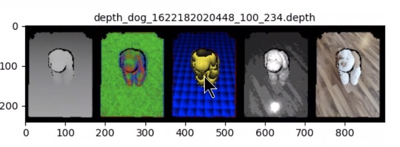

# CGM Depthmap Toolkit

Utilities for loading, visualising, preprocessing, and exporting depth maps captured by the Child Growth Monitor (CGM) scanner. The toolkit works with CGM depthmap archives, optional aligned RGB images, and camera calibration files.

## Features

- Load CGM depthmap ZIP files and parse depth, confidence, pose, and calibration data.
- Visualise depth, surface normals, segmentation, confidence, and RGB frames.
- Detect floor and child/object regions from depth geometry.
- Export point clouds and meshes as PLY or OBJ files.
- Preprocess depth maps by removing out-of-range values and filling missing values.
- Analyse RGB-depth alignment, segment children with YOLO/SAM, inpaint depth maps, and estimate distances or child height from masks.

## Repository Layout

```text
.
|-- depthmap_toolkit/
|   |-- depthmap.py                 # Core depthmap parser and geometry utilities
|   |-- toolkit.py                  # Interactive visualisation/export tool
|   |-- exporter.py                 # PLY/OBJ export helpers
|   |-- visualisation.py            # Depth/normal/segmentation rendering
|   |-- rgb_depth_processor.py      # RGB-depth alignment, segmentation, inpainting utilities
|   |-- depthmap_utils.py           # Matrix, parsing, and image helper functions
|   |-- constants.py
|   |-- camera_calibration_*.txt    # Example calibration files
|   `-- docs/depthmapToolkitViz.jpg
|-- depthmap_preprocess.py          # Standalone depth preprocessing helpers
|-- analyse_csv.ipynb               # Analysis notebook
|-- visualize_analyze_at_child_level.ipynb
|-- setup.py
`-- LICENSE
```

## Installation

Create and activate a Python environment, then install the package in editable mode:

```bash
python -m venv .venv
.venv\Scripts\activate
pip install -e .
```

Install the runtime dependencies used by the core viewer/exporter:

```bash
pip install numpy scipy matplotlib pillow open3d scikit-image
```

The RGB-depth processing utilities in `depthmap_toolkit/rgb_depth_processor.py` use additional ML/computer-vision packages:

```bash
pip install opencv-python torch torchvision ultralytics tqdm requests
pip install git+https://github.com/facebookresearch/segment-anything.git
```

You will also need the model checkpoints expected by your workflow, such as a YOLOv8 segmentation checkpoint and a SAM checkpoint.

## Input Data

The interactive viewer expects a scan directory with this structure:

```text
scan_dir/
|-- depth/
|   |-- frame_000.depth
|   `-- frame_001.depth
`-- rgb/
    |-- frame_000.jpg
    `-- frame_001.jpg
```

The `rgb` directory is optional. The `depth` directory is required.

A calibration file should contain color and depth camera intrinsic values, for example:

```text
Color camera intrinsic:
0.6786797 0.90489584 0.49585155 0.5035042
Depth camera intrinsic:
0.6786797 0.90489584 0.49585155 0.5035042
```

Example calibration files are included in `depthmap_toolkit/camera_calibration_p30pro_EU.txt` and `depthmap_toolkit/camera_calibration_lenovo.txt`.

## Interactive Viewer

Run the viewer with a scan directory and calibration file:

```bash
python -m depthmap_toolkit.toolkit path\to\scan_dir depthmap_toolkit\camera_calibration_lenovo.txt
```

The viewer lets you:

- Move between depthmaps with the `<<` and `>>` buttons.
- Click points to log their 3D coordinates and distance from the previous clicked point.
- Export point clouds as PLY files.
- Export textured meshes as OBJ files.
- Export Poisson-reconstructed meshes as OBJ files.

Exports are written to a `data/export` directory relative to the repository layout used by the toolkit.

## Visualisation Output



The visualisation shows, from left to right:

- Depth image: raw depth values rendered as grayscale.
- World-oriented normals: surface normal directions rendered as RGB.
- Metric segmentation: floor and child/object regions with a repeating metric pattern.
- Confidence map: ToF confidence/IR reflection values.
- RGB photo: aligned image when available, with the detected face area blurred.

## Python Usage

Load a depthmap and optional RGB frame directly:

```python
from depthmap_toolkit.depthmap import Depthmap

dmap = Depthmap.create_from_zip_absolute(
    depthmap_fpath="path/to/depth/frame.depth",
    rgb_fpath="path/to/rgb/frame.jpg",
    calibration_fpath="depthmap_toolkit/camera_calibration_lenovo.txt",
)

floor = dmap.get_floor_level()
mask = dmap.segment_child(floor)
distance = dmap.get_distance_of_child_from_camera(mask)
```

Export a point cloud:

```python
from depthmap_toolkit.exporter import export_ply

floor = dmap.get_floor_level()
export_ply("output.ply", dmap, floor)
```

Preprocess depth maps:

```python
from depthmap_preprocess import (
    replace_values_above_threshold_by_zero,
    replace_values_above_threshold_by_neighbor,
    fill_zeros_inpainting,
)

clean_depth = replace_values_above_threshold_by_zero(depth_map, threshold=3.0)
filled_depth = fill_zeros_inpainting(clean_depth)
```

Use RGB-depth helpers:

```python
from depthmap_toolkit.rgb_depth_processor import RGBDepthProcessor

processor = RGBDepthProcessor()
score, status = processor.check_rgb_depth_alignment(rgb, depth, max_depth=1.5)
child_mask, foot_mask, remaining_mask = processor.detect_and_segment(rgb, depth)
```

## Notebooks

This repository includes notebooks for exploratory analysis and visualisation:

- `analyse_csv.ipynb`
- `visualize_analyze_at_child_level.ipynb`
- `depthmap_toolkit/scan_toolkit.ipynb`
- `depthmap_toolkit/view_depthmap_realsence.ipynb`

Open them in Jupyter after installing the dependencies required by the notebook cells.

## Notes

- Depth values are handled in meters after applying the scale from the depthmap header.
- Exported geometry is reoriented with the device pose when pose data is available.
- Confidence values depend on the ToF sensor and are not recommended as training labels without device-specific validation.
- Some legacy code paths were originally used inside the wider CGM codebase. If imports fail in a standalone checkout, update `cgmml.common.depthmap_toolkit...` imports to `depthmap_toolkit...`.

## License

This project is licensed under the GNU General Public License v3.0 or later. See `LICENSE` for details.
